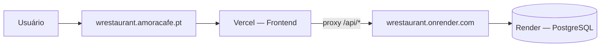

# Amora Café — Restaurant

Monorepo fullstack para gestão do **Amora Café**: mesas, pedidos, estoque, financeiro e operação offline-first.

| Camada | Stack |
|--------|-------|
| Frontend | Next.js 16, React 19, Tailwind CSS 4 |
| Backend | FastAPI, SQLAlchemy 2, PostgreSQL 16 |
| Local | Docker Compose + Makefile |

---

## Deploy em produção

A aplicação em produção está dividida em **três serviços** — o frontend **não** vai para o Render:

| Serviço | Onde roda | URL |
|---------|-----------|-----|
| **Frontend** | Vercel | https://wrestaurant.amoracafe.pt/ |
| **Backend (API)** | Render | https://wrestaurant.onrender.com/ |
| **Banco** | Render PostgreSQL | interno (só o backend acessa) |



> **Importante:** `https://wrestaurant.onrender.com/` é só a **API** (FastAPI). A interface do app continua na Vercel. Na Vercel você só **aponta** o frontend para essa URL — não faz deploy do Next.js no Render.

### Frontend — Vercel

| Item | Valor |
|------|-------|
| **Provedor** | [Vercel](https://vercel.com) |
| **URL pública (DNS)** | https://wrestaurant.amoracafe.pt/ |
| **Deployment Vercel** | `wrestaurant-hh4tvaf36-walternascimentobarrosos-projects.vercel.app` |
| **Diretório no deploy** | `frontend/` |
| **Build** | `npm run build` |
| **Start** | `npm run start` |

O frontend faz proxy das chamadas `/api/*` para o backend via rewrites do Next.js (`frontend/next.config.ts`). No browser, a API é same-origin; no SSR, o Next.js chama o backend diretamente.

**Variáveis de ambiente na Vercel** (Settings → Environment Variables):

| Variável | Valor em produção |
|----------|-------------------|
| `BACKEND_URL` | `https://wrestaurant.onrender.com` |
| `NEXT_PUBLIC_API_URL` | `https://wrestaurant.onrender.com` |
| `NEXT_PUBLIC_ADMIN_PASSWORD` | mesma senha do `ADMIN_PASSWORD` no Render |

Após alterar variáveis `NEXT_PUBLIC_*`, faça **Redeploy** na Vercel (Deployments → ⋮ → Redeploy).

---

### Backend — Render

| Item | Valor |
|------|-------|
| **Provedor** | [Render](https://render.com) — Web Service |
| **URL pública** | https://wrestaurant.onrender.com/ |
| **Health check** | https://wrestaurant.onrender.com/api/health |
| **Swagger** | https://wrestaurant.onrender.com/docs |
| **Dashboard** | https://dashboard.render.com/web/srv-d91vin9o3t8c73eot8rg |
| **Root on deploy** | `backend/` |
| **Runtime** | Docker (`backend/Dockerfile`) |
| **Start command** | `uvicorn app.main:app --host 0.0.0.0 --port $PORT` |

**Variáveis de ambiente no Render:**

| Variável | Descrição |
|----------|-----------|
| `DATABASE_URL` | **Internal Database URL** do PostgreSQL no Render (não usar a URL externa) |
| `SECRET_KEY` | Chave secreta para JWT (valor forte, único em produção) |
| `ADMIN_PASSWORD` | Senha do admin |
| `CORS_ORIGINS` | `https://wrestaurant.amoracafe.pt` (ou JSON: `["https://wrestaurant.amoracafe.pt"]`) |

Na subida, o backend executa migrations e seed automaticamente (`backend/app/main.py` → `init_db()`).

---

### Banco de dados — Render PostgreSQL

| Item | Valor |
|------|-------|
| **Provedor** | [Render](https://render.com) — PostgreSQL |
| **Host interno** | `dpg-d91vhhrsq97s73dva560-a` |
| **Database** | `restaurant_16sy` |
| **User** | `restaurant` |

> **Segurança:** a connection string completa (com senha) fica **apenas** no painel Render → PostgreSQL → **Connections**. Nunca commite credenciais no repositório. Use a **Internal Database URL** na variável `DATABASE_URL` do backend.

---

## Desenvolvimento local

Pré-requisitos: Docker e Make.

```bash
make help    # lista todos os comandos
make up      # sobe frontend, backend e PostgreSQL
make health  # GET /api/health no backend local
make stop    # para os containers
```

O Makefile cria `.env` a partir de `.env.example` na primeira execução.

| Serviço | URL local |
|---------|-----------|
| Frontend | http://localhost:3000 |
| Backend | http://localhost:8000 |
| API | http://localhost:8000/api/health |

Documentação técnica detalhada: [`AGENTS.md`](./AGENTS.md).

---

## Estrutura do repositório

```
restaurant/
├── frontend/          # Next.js (deploy: Vercel)
├── backend/           # FastAPI (deploy: Render)
├── docker-compose.yml # stack local
├── Makefile
├── .env.example       # template de variáveis locais
└── docs/offline-first/  # plano offline-first por fases
```

---

## Variáveis de ambiente (referência)

Ver [`.env.example`](./.env.example). Resumo:

| Variável | Local | Produção |
|----------|-------|----------|
| `DATABASE_URL` | `postgresql://…@db:5432/restaurant` | Internal URL do Render |
| `CORS_ORIGINS` | `["http://localhost:3000"]` | `https://wrestaurant.amoracafe.pt` |
| `BACKEND_URL` / `NEXT_PUBLIC_API_URL` | `http://localhost:8000` | `https://wrestaurant.onrender.com` |
| `SECRET_KEY` / `ADMIN_PASSWORD` | valores de dev | valores fortes, só no painel cloud |
